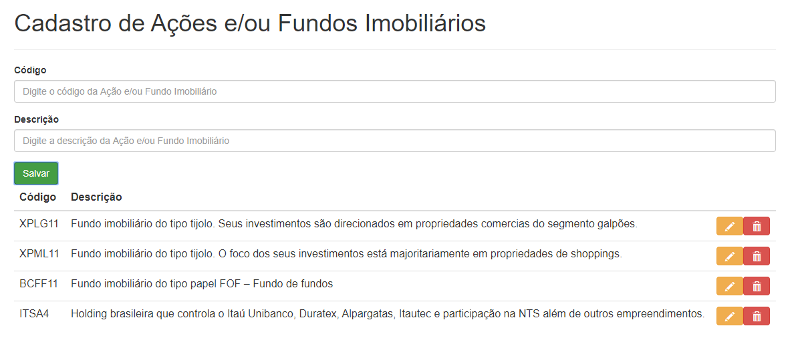
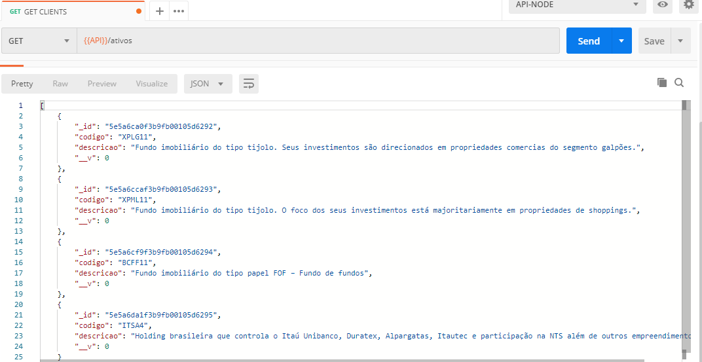

# node-mongo-compose

Ecosistema microservice básico com frontend, backend e banco mongo utilizando docker e dockercompose.
  

## 1. Baixar projeto

`$ git clone https://github.com/Maddytec/node-mongo-compose.git`

  

## 2. Inicializando os serviços

`$ cd node-mongo-compose`

`$ docker-compose up -d`

  

Requisitos para inicializar os serviços:

*  [Docker](https://docs.docker.com/get-docker/)

*  [Docker Compose](https://docs.docker.com/compose/install/)

  

## 3. Como testar o projeto?

  

Após executar o item 2:

  
### 3.1 - Tela de Cadastro de Ações e/ou Fundos Imobiliários:

 - Acessar a URL: [http://localhost](http://localhost) para visualizar a pagina disponibilizada referente ao frontend

 Figura 1 - Tela de Cadastro de Ações e/ou Fundos Imobiliários 
  
### 3.2 - Consulta do serviço de Cadastro de Ações e/ou Fundos Imobiliários:
- Acessar a URL: [http://localhost:3000/ativos](http://localhost:3000/ativos) para visualizar a pagina disponibilizada referente ao backend

  Figura 2 - Exemplo do Json retornado pelo backend

## 4. Remover os serviços

`$ docker-compose stop`

`$ docker-compose rm`

  

## 5. License

Este código é open source.
